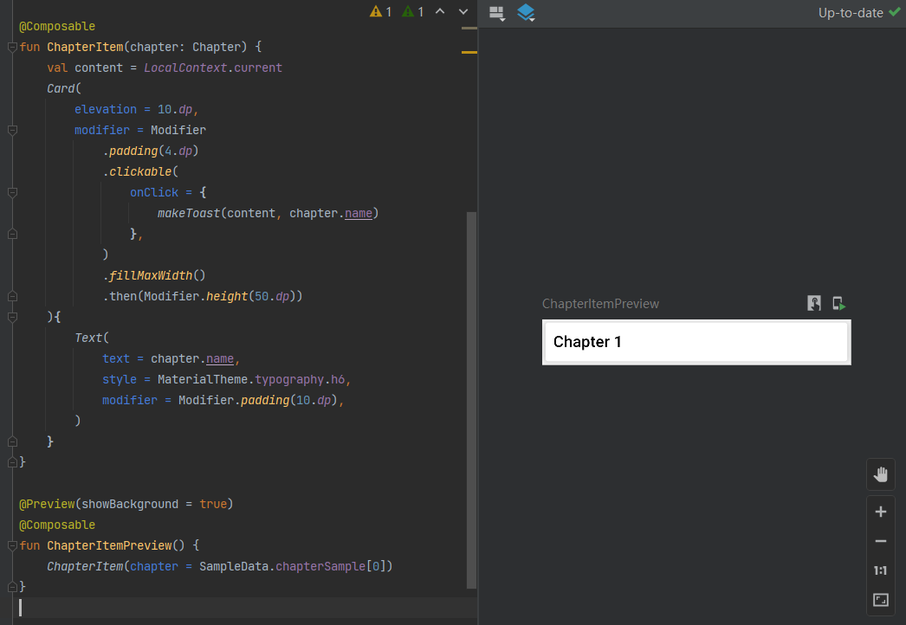

# Card

```kotlin
Card(
    elevation = 10.dp,
    modifier = Modifier
    .padding(4.dp)
    .clickable(
        onClick = {
            ...
        },
    )
    .fillMaxWidth()
    .then(Modifier.height(50.dp))
){
    Text(
        text = ...,
        style = MaterialTheme.typography.h6,
        modifier = Modifier.padding(10.dp),
    )
}
```


