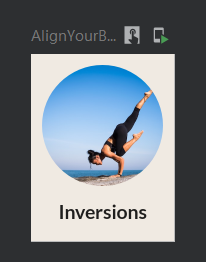

# Alignment



```kotlin
@Composable
fun AlignYourBodyElement(
    @DrawableRes drawable: Int, // 这里使用了外部的资源文件，这里提供这样的接口就便于我们去修改
    @StringRes text: Int,
    modifier: Modifier = Modifier
) {
    Column(
        horizontalAlignment = Alignment.CenterHorizontally,
        modifier = modifier
    ) {
        Image(
            painter = painterResource(id = drawable),
            contentDescription = null,
            contentScale = ContentScale.Crop,
            modifier = Modifier
                .size(88.dp)
                .clip(CircleShape)
        )
        Text(
            text = stringResource(id = text),
            style = MaterialTheme.typography.h3,
            modifier = Modifier.paddingFromBaseline(top = 24.dp,bottom = 8.dp)
        )

    }
}
```

```kotlin
@Preview(showBackground = true, backgroundColor = 0xFFF0EAE2)
@Composable
fun AlignYourBodyElementPreview() {
    MySootheTheme {
        AlignYourBodyElement(
            drawable = R.drawable.ab1_inversions,
            text = R.string.ab1_inversions,
            modifier = Modifier.padding(8.dp)
        )
    }
}
```

