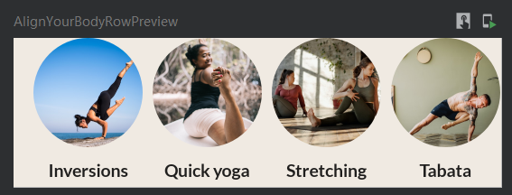

# AlignRow



```kotlin
@Composable
fun AlignYourBodyRow(
    modifier: Modifier = Modifier
) {
    LazyRow(
        horizontalArrangement = Arrangement.spacedBy(8.dp),
        contentPadding = PaddingValues(horizontal = 16.dp), // 这段是为了再LazyRow里的开头和结尾加入一小段空处
        modifier = modifier, // 不能在这里加padding，因为这里的padding是针对LazyRow这个视图本身的
    ){
        items(alignYourBodyData){item ->
            AlignYourBodyElement(
                drawable = item.drawable,
                text = item.text
            )
        }
    }
}
```

