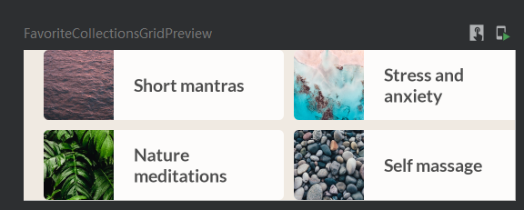

# CollectionGrid



```kotlin
@Composable
fun FavoriteCollectionsGrid(
    modifier: Modifier = Modifier
) {
    LazyHorizontalGrid(
        rows = GridCells.Fixed(2),
        contentPadding = PaddingValues(horizontal = 16.dp),
        horizontalArrangement = Arrangement.spacedBy(8.dp),
        verticalArrangement = Arrangement.spacedBy(8.dp),
        modifier = modifier.height(120.dp)
    ){
        items(favoriteCollectionsData.size){ item ->
            FavoriteCollectionCard(
                drawable = favoriteCollectionsData[item].drawable,
                text = favoriteCollectionsData[item].text
            )
        }
    }
}
```

上面在官方教程中是可以像下面这样写的，但是由于奇怪的包import没正确的问题就不行。

```kotlin
items(favoriteCollectionsData){ item ->
    FavoriteCollectionCard(
        drawable = item.drawable,
        text = item.text
    )
}
```

```kotlin
private val favoriteCollectionsData = listOf(
    R.drawable.fc1_short_mantras to R.string.fc1_short_mantras,
    R.drawable.fc2_nature_meditations to R.string.fc2_nature_meditations,
    R.drawable.fc3_stress_and_anxiety to R.string.fc3_stress_and_anxiety,
    R.drawable.fc4_self_massage to R.string.fc4_self_massage,
    R.drawable.fc5_overwhelmed to R.string.fc5_overwhelmed,
    R.drawable.fc6_nightly_wind_down to R.string.fc6_nightly_wind_down
).map { DrawableStringPair(it.first, it.second) }
```

