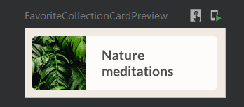

# Favorite Collection Card



```kotlin
@Composable
fun FavoriteCollectionCard(
    @DrawableRes drawable: Int,
    @StringRes text: Int,
    modifier: Modifier = Modifier
) {
    Surface(
        shape = MaterialTheme.shapes.small,
        modifier = modifier
    ) {
        Row (
            verticalAlignment = Alignment.CenterVertically,
            modifier = Modifier.width(192.dp)
                ){
            Image(
                painter = painterResource(id = drawable),
                contentDescription = null,
                contentScale = ContentScale.Crop,
                modifier = Modifier.size(56.dp)
            )
            Text(
                text = stringResource(id = text),
                style = MaterialTheme.typography.h3,
                modifier = Modifier.padding(horizontal = 16.dp)
            )
        }
    }
}
```

```kotlin
fun FavoriteCollectionCardPreview() {
    MySootheTheme {
        FavoriteCollectionCard(
            drawable = R.drawable.fc2_nature_meditations,
            text = R.string.fc2_nature_meditations,
            modifier = Modifier.padding(8.dp)
        )
    }
}
```

