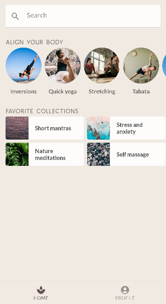

# Scaffold



```kotlin
Scaffold(
	bottomBar = { SootheBottomNavigation() }
) {
	PaddingValues -> HomeScreen(Modifier.padding(PaddingValues))
}
```

记住很重要的一点的是外面需要套上当前主题的Theme才能正确显示：

```kotlin
@Composable
fun MySootheApp() {
    MySootheTheme {
        Scaffold(
            bottomBar = { SootheBottomNavigation() }
        ) {
            PaddingValues -> HomeScreen(Modifier.padding(PaddingValues))
        }
    }
}
```

