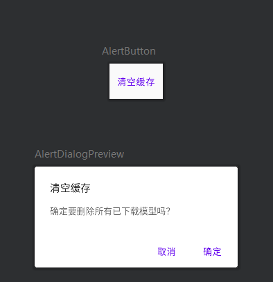

# AlertButton



按下后会弹出AlertDialog来提示是否进一步操作：

```kotlin
@Preview(showBackground = true)
@Composable
fun AlertButton(
    modifier: Modifier = Modifier,
    onDeleteAllModel: () -> Unit = {}
){
    var isShowDialog by remember { mutableStateOf(false) }
    TextButton(
        modifier = modifier.padding(4.dp),
        onClick = {
            isShowDialog = true
        }
    ) {
        Text(text = "清空缓存")
    }


    MyAlertDialog(
        isShowDialog = isShowDialog,
        onConfirm = onDeleteAllModel,
        onDismiss = { isShowDialog = false }
    )
}

@Composable
fun MyAlertDialog(
    modifier: Modifier = Modifier,
    isShowDialog: Boolean = false,
    onConfirm: () -> Unit = {},
    onDismiss: () -> Unit = {}
) {
    if (isShowDialog) {
        AlertDialog(
            modifier = modifier,
            onDismissRequest = onDismiss,
            title = { Text(text = "清空缓存") },
            text = { Text(text = "确定要删除所有已下载模型吗？") },
            confirmButton = {
                TextButton(
                    onClick = {
                        // TODO: 清空缓存
                        onConfirm()
                        onDismiss()
                    }
                ) {
                    Text(text = "确定")
                }
            },
            dismissButton = {
                TextButton(
                    onClick = onDismiss
                ) {
                    Text(text = "取消")
                }
            }
        )
    }
}


@Preview(showBackground = true)
@Composable
fun AlertDialogPreview(){
    MyAlertDialog(
        isShowDialog = true,
        onConfirm = {},
        onDismiss = {}
    )
}
```

