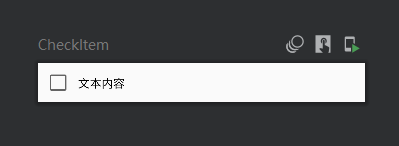

# CheckItem



```kotlin
@Preview(showBackground = true)
@Composable
fun CheckItem(
    modifier: Modifier = Modifier,
    text: String = "文本内容",
    checked: Boolean = false,
    onCheckedChange: (Boolean) -> Unit = {},
){
    Row (
        modifier = modifier.fillMaxWidth().clickable {
            onCheckedChange(!checked)
        },
        verticalAlignment = Alignment.CenterVertically
    ){
        Checkbox(
            checked = checked,
            onCheckedChange = onCheckedChange
        )
        Text(
            text = text,
            style = MaterialTheme.typography.body2
        )
    }
}
```

