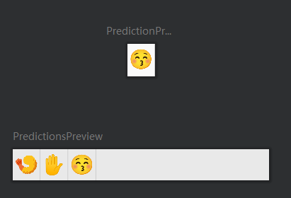

```kotlin
@Composable
fun Prediction(
    text: String,
    modifier: Modifier = Modifier,
    onClick: (String) -> Unit // 点击事件处理方法
) {
    Row(modifier = modifier) { // 使用 Row 横向排列子组件
        Text(
            text = text, // 显示的文本
            fontSize = 30.sp, // 字体大小为 14dp
            color = DrawColors.PredictionText, // 文本颜色为主题中的 PredictionText 颜色
            modifier = modifier
//                .padding(horizontal = 16.dp, vertical = 8.dp) // 左右间距为 16dp，上下间距为 8dp
                .padding(2.dp)
                .clickable { onClick.invoke(text) }, // 添加点击事件，点击时调用 onClick 方法并传入文本内容
        )

        Box(modifier = Modifier
            .fillMaxHeight()
            .width(1.dp)
            .background(DrawColors.PredictionDivider) // 添加一条垂直分割线，颜色为主题中的 PredictionDivider 颜色
        )
    }
}

@Composable
fun Predictions(
    modifier: Modifier = Modifier,
    predictions: List<String>,
    onClick: (String) -> Unit // 点击事件处理方法
) {
    LazyRow( // 使用 LazyRow 组件创建水平滚动列表
        modifier = modifier
            .fillMaxWidth()
            .height(48.dp)
            .background(DrawColors.PredictionBackground) // 列表背景色为主题中的 PredictionBackground 颜色
    ) {
        items(
            predictions
        ) { prediction ->
            // 遍历 viewModel 的 predictions 列表
            // 创建多个 Prediction 组件
            Prediction(
                text = prediction,
                onClick = onClick
            )
        }
    }
}

@Preview(showBackground = true,heightDp = 50)
@Composable
fun PredictionPreview() {
    Prediction(text = "😚"){
        println(it)
    }
}

@Preview(showBackground = true)
@Composable
fun PredictionsPreview() {
    Predictions(
        predictions = testDrawState.predictions ,
    ){
        println(it)
    }
}
```

