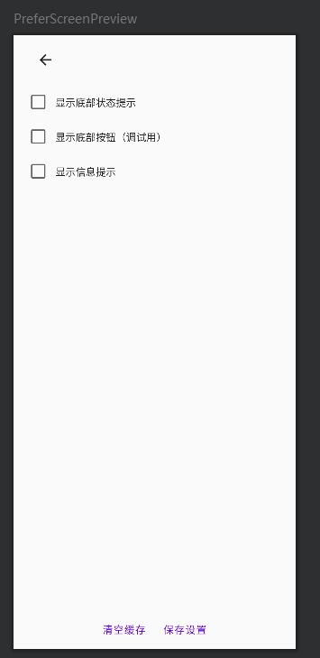

```kotlin
@Composable
fun PreferScreen(
    modifier: Modifier = Modifier,
    debugText: @Composable () -> Unit = {},
    onSaveSettings: () -> Unit = {},
    onDeleteAllModel: () -> Unit = {},
    onExit: () -> Unit = {},
    isShowBottomStatus: Boolean = true,
    onShowStatusChange: (Boolean) -> Unit = {},
    isShowBottomButton: Boolean = true,
    onShowBottomBarChange: (Boolean) -> Unit = {},
    isShowInfo: Boolean = true,
    onShowInfoChange: (Boolean) -> Unit = {},
){
    Box(
        modifier = modifier.fillMaxSize()
    ) {
        Column(
            modifier = modifier
                .padding(horizontal = 10.dp)
                .align(Alignment.TopStart)
                .fillMaxWidth()
        ) {
            IconButton(
                modifier = Modifier
                    .padding(10.dp),
                onClick = onExit
            ){
                Icon(
                    painter = painterResource(id = R.drawable.baseline_arrow_back_24),
                    contentDescription = "返回"
                )
            }
            debugText()
            CheckItem(
                text = "显示底部状态提示",
                checked = isShowBottomStatus,
                onCheckedChange = onShowStatusChange
            )
            CheckItem(
                text = "显示底部按钮（调试用）",
                checked = isShowBottomButton,
                onCheckedChange = onShowBottomBarChange
            )
            CheckItem(
                text = "显示信息提示",
                checked = isShowInfo,
                onCheckedChange = onShowInfoChange
            )
        }
        Row(
            modifier = Modifier.align(Alignment.BottomCenter)
        ) {
            AlertButton(
                onDeleteAllModel = onDeleteAllModel
            )
            TextButton(
                modifier = Modifier
                    .padding(4.dp),
                onClick = onSaveSettings
            ) {
                Text(text = "保存设置")
            }
        }
    }
}

@Preview(showBackground = true)
@Composable
fun PreferScreenPreview(){
    var isShowStatus by remember { mutableStateOf(false) }
    var isShowBottomButton by remember { mutableStateOf(false) }
    var isShowInfo by remember { mutableStateOf(false) }
    val context = LocalContext.current
    DrawSpace2Theme(
//        darkTheme = true
    ) {
        PreferScreen(
            onSaveSettings = {
                makeToast(context, "保存设置成功")
            },
            isShowBottomStatus = isShowStatus,
            isShowBottomButton = isShowBottomButton,
            isShowInfo = isShowInfo,
            onShowStatusChange = { isShowStatus = it },
            onShowBottomBarChange = { isShowBottomButton = it },
            onShowInfoChange = { isShowInfo = it }
        )
    }
}
```

