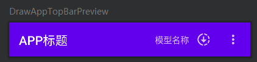
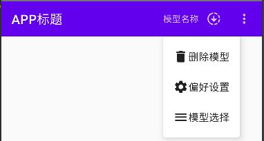

```kotlin
@Composable
fun DrawAppTopBar(
    modifier: Modifier = Modifier,
    title: @Composable () -> Unit,
    modelStatus: ModelStatus,
    selectedModelName: String,
    onModelListExpandedChange: () -> Unit,
    onDownloadModelClick: () -> Unit,
    onDeleteClick: () -> Unit,
    onSettingPreferences: () -> Unit,
) {
    var isShowMenu by remember { mutableStateOf(false) }
    TopAppBar(
        title = title,
        backgroundColor = MaterialTheme.colors.primary,
        actions = {
            Text(text = selectedModelName)
            IconButton(onClick = onDownloadModelClick) {
                /* TODO: 这里需要观察外面的模型下载的状态来更新下面的图标 */
                Icon(
                    painter = painterResource(
                        id = when (modelStatus) {
                            ModelStatus.NOT_DOWNLOADED -> R.drawable.baseline_download_24
                            ModelStatus.DOWNLOADING -> R.drawable.baseline_downloading_24
                            ModelStatus.DOWNLOADED -> R.drawable.baseline_download_done_24
                        }
                    ),
                    contentDescription = null
                )
            }
            IconButton(
                onClick = { isShowMenu = !isShowMenu },
            ) {
                Icon(
                    Icons.Default.MoreVert,
                    contentDescription = null
                )
            }
            DropdownMenu(expanded = isShowMenu, onDismissRequest = { isShowMenu = false }) {
                DropdownMenuItem(onClick = {
                    onDeleteClick()
                    isShowMenu = false
                }) {
                    Icon(painter = painterResource(id = R.drawable.baseline_delete_24), "")
                    Text(text = "删除模型")
                }
                DropdownMenuItem(onClick = {
                    onSettingPreferences()
                    isShowMenu = false
                }) {
                    Icon(painter = painterResource(id = R.drawable.baseline_settings_24), "")
                    Text(text = "偏好设置")
                }
                DropdownMenuItem(onClick = {
                    onModelListExpandedChange()
                    isShowMenu = false
                }) {
                    Icon(painter = painterResource(id = R.drawable.baseline_menu_24), "")
                    Text(text = "模型选择")
                }
            }
        }
    )
}

@Preview(showBackground = true)
@Composable
fun DrawAppTopBarPreview() {
    val context = LocalContext.current
    DrawAppTopBar(
        title = { Text(text = "APP标题") },
        modelStatus = ModelStatus.DOWNLOADING,
        selectedModelName = "模型名称",
        onModelListExpandedChange = {
            makeToast(context, "展开模型列表")
            /* TODO: 这里需要点击后更改外界状态展开模型列表 */
        },
        onDownloadModelClick = {
            makeToast(context, "开始下载模型")
            /* TODO: 这里需要点击后更改外界状态开始下载模型(代替底边栏) */
        },
        onDeleteClick = {
            makeToast(context, "模型已被删除")
            /* TODO: 这里需要点击后更改外界状态删除模型 */
        },
        onSettingPreferences = {
            makeToast(context, "隐藏底边栏")
            /* TODO: 这里需要点击后更改外界状态隐藏底边栏 */
        }
    )
}
```

