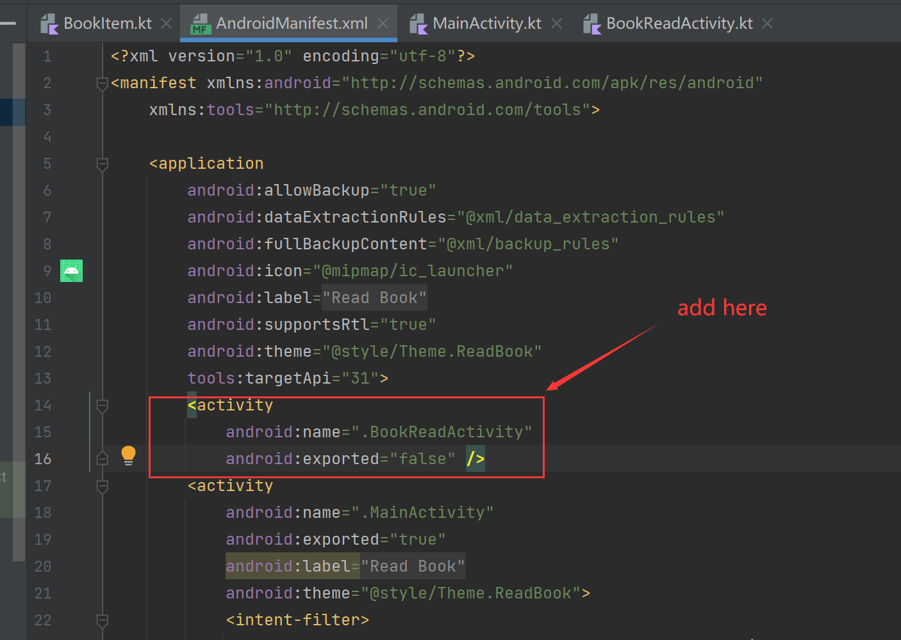

# Activity

新建一个Activity时候一定要记得在`AndroidManifest.xml`中注册该activity，否则在点击按钮的时候app会直接报错退出：

```xml
<activity
    android:name=".BookReadActivity"
    android:exported="false" />
```



> 在老师的第十次录播中会有专门讲compose和activity联动的课程。