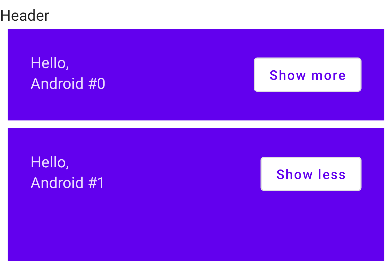
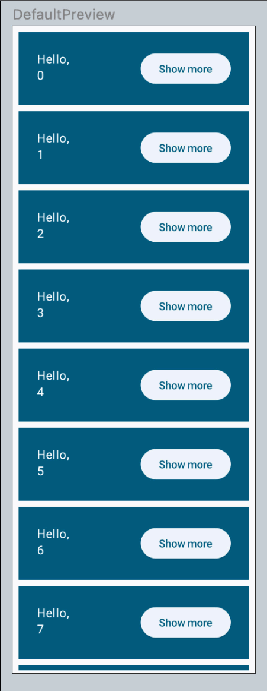

# Animation

```kotlin
val extraPadding = if (expanded) 48.dp else 0.dp
```

在自己的app中设置了一个展开的效果，但是想把它设置成动画：



把上面语句改成下面即可：

```kotlin
val extraPadding by animateDpAsState(
    targetValue = if (expanded) 48.dp else 0.dp,
    animationSpec = tween(
        durationMillis = 1000,
    )
)
```

**源代码**

```kotlin
@Composable
fun Greeting(name: String) {
    var expanded by remember { mutableStateOf(false) }
//    val extraPadding = if (expanded) 48.dp else 0.dp
    val extraPadding by animateDpAsState(
        targetValue = if (expanded) 48.dp else 0.dp,
        animationSpec = tween(
            durationMillis = 1000,
        )
    )
    Surface(
        ...
    ) {
        Row (
            ...
                ){
            Column(
                modifier = Modifier
                    .weight(1f)
                    .padding(bottom = extraPadding)
            ) {
                Text(text = "Hello,")
                Text(text = name)
            }
            OutlinedButton(onClick = { expanded = !expanded }) {
                Text(if (expanded) "Show less" else "Show more")
            }
        }
    }
}
```

> 感觉上动画无非就是在两个值之间做插值，从而进行一个线性或者非线性的平滑过渡，用compose可以帮助我们节约了很多时间


## animationSpec

在上面代码中我们用的是tween的动画速度模式，实际上我们可以使用spring(弹簧)的模式

```kotlin
@Composable
fun Greeting(name: String) {

    var expanded by remember { mutableStateOf(false) }

    val extraPadding by animateDpAsState(
        if (expanded) 48.dp else 0.dp,
        animationSpec = spring(
            dampingRatio = Spring.DampingRatioMediumBouncy,
            stiffness = Spring.StiffnessLow
        )
    )

    Surface(
    ...
            Column(modifier = Modifier
                .weight(1f)
                .padding(bottom = extraPadding.coerceAtLeast(0.dp))

    ...

    )
}
```

需要注意的是我们同时也更改了`bottom = extraPadding.coerceAtLeast(0.dp)`，保证弹簧动画在改变时padding不会减少到零；

