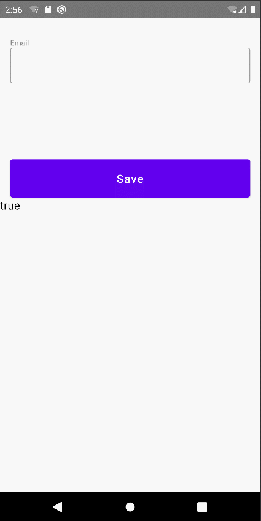

# datastore

- 数据存取技术

参考这个例子：https://www.youtube.com/watch?v=tD0wi5sH0aQ

添加依赖：

```
// datastore
implementation "androidx.datastore:datastore-preferences:1.0.0"
```

- StoreIsShowStatus

```kotlin
package com.linkdom.drawspace2.data.datastore

...

class StoreIsShowStatus(
    private val context: Context
) {
    // to make sure there is only one instance of datastore
    companion object {
        private const val PREFS_NAME = "UserSettingIsShowStatus"
        private val Context.dataStore by preferencesDataStore(PREFS_NAME)
        val PREFS_KEY = stringPreferencesKey("IsShowStatus_KEY")
    }

    // to get the user settings from datastore
    val getUserSettings: Flow<String?> = context.dataStore.data
        .map { preferences ->
            preferences[PREFS_KEY]
        }

    // to save the user settings to datastore
    suspend fun saveUserSettings(userSettings: String) {
        context.dataStore.edit { preferences ->
            preferences[PREFS_KEY] = userSettings
        }
    }

}
```

- StoreScreen

```kotlin
package com.linkdom.drawspace2.ui.screen

...

@Preview(showBackground = true)
@Composable
fun StoreScreen() {

    // context
    val context = LocalContext.current
    // scope
    val scope = rememberCoroutineScope()
    // datastore Email
    val dataStore = StoreIsShowStatus(context)
    // get saved email
    val savedEmail = dataStore.getUserSettings.collectAsState(initial = "")
    var email by remember { mutableStateOf("") }


    Column(modifier = Modifier.fillMaxSize()) {

        Text(
            modifier = Modifier
                .padding(16.dp, top = 30.dp),
            text = "Email",
            color = Color.Gray,
            fontSize = 12.sp
        )
        //email field
        OutlinedTextField(
            modifier = Modifier
                .padding(start = 16.dp, end = 16.dp)
                .fillMaxWidth(),
            value = email,
            onValueChange = { email = it },
        )
        Spacer(modifier = Modifier.height(120.dp))
        // save button
        Button(
            modifier = Modifier
                .fillMaxWidth()
                .height(60.dp)
                .padding(start = 16.dp, end = 16.dp),
            onClick = {
                //launch the class in a coroutine scope
                scope.launch {
                    dataStore.saveUserSettings(email)
                }
            },
        ) {
            // button text
            Text(
                text = "Save",
                color = Color.White,
                fontSize = 18.sp
            )
        }

        Text(
            text = savedEmail.value?:"",
            color = Color.Black,
            fontSize = 18.sp
        )
    }
}
```

