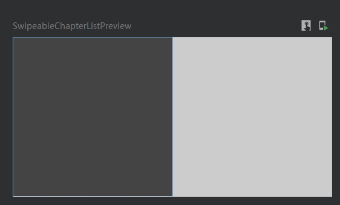

# Modifier


## swipeable

> 需要注意的是问chatgpt或者new bing的话，他们给你的回答一般都是2021.9之前的，有那么一点点过时（就是用不了），得回去看官方文档中的示例

可以左右滑动下面这个小方块，不知道能不能可以用来做读书app的翻页



```kotlin
package com.linkdom.readbook.learning

import androidx.compose.foundation.background
import androidx.compose.foundation.gestures.Orientation
import androidx.compose.foundation.layout.*
import androidx.compose.material.*
import androidx.compose.runtime.Composable
import androidx.compose.ui.Modifier
import androidx.compose.ui.graphics.Color
import androidx.compose.ui.platform.LocalDensity
import androidx.compose.ui.tooling.preview.Preview
import androidx.compose.ui.unit.IntOffset
import androidx.compose.ui.unit.dp
import kotlin.math.roundToInt


@OptIn(ExperimentalMaterialApi::class)
@Composable
private fun SwipeableSample() {
    val width = 96.dp
    val squareSize = 48.dp

    val swipeableState = rememberSwipeableState(0)
    val sizePx = with(LocalDensity.current) { squareSize.toPx() }
    val anchors = mapOf(0f to 0, sizePx to 1) // Maps anchor points (in px) to states

    Box(
        modifier = Modifier
            .width(width)
            .swipeable(
                state = swipeableState,
                anchors = anchors,
                thresholds = { _, _ -> FractionalThreshold(0.3f) },
                orientation = Orientation.Horizontal
            )
            .background(Color.LightGray)
    ) {
        Box(
            Modifier
                .offset { IntOffset(swipeableState.offset.value.roundToInt(), 0) }
                .size(squareSize)
                .background(Color.DarkGray)
        )
    }
}

@Preview(showBackground = true)
@Composable
fun SwipeableChapterListPreview() {
    SwipeableSample()
}


```

