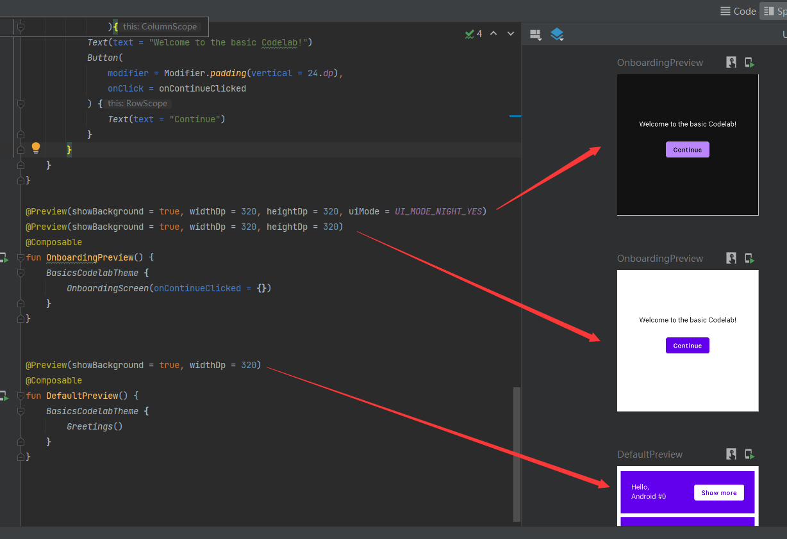

# Preview

```
@Preview(showBackground = true)
```

```kotlin
@Preview(showBackground = true, widthDp = 320, heightDp = 320)
```

在文件中使用@preview可以使得我们很方便地去预览所写的compose代码框架，而一个preview就是对应一个预览图；



## 黑夜模式

```kotlin
@Preview(showBackground = true, widthDp = 320, heightDp = 320, uiMode = UI_MODE_NIGHT_YES)
```

