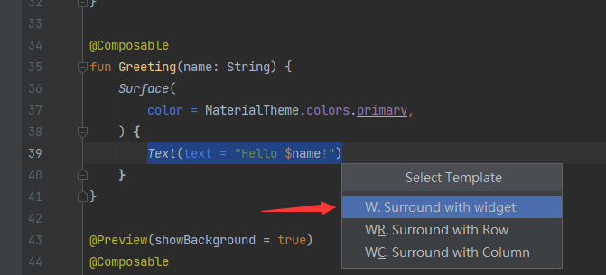
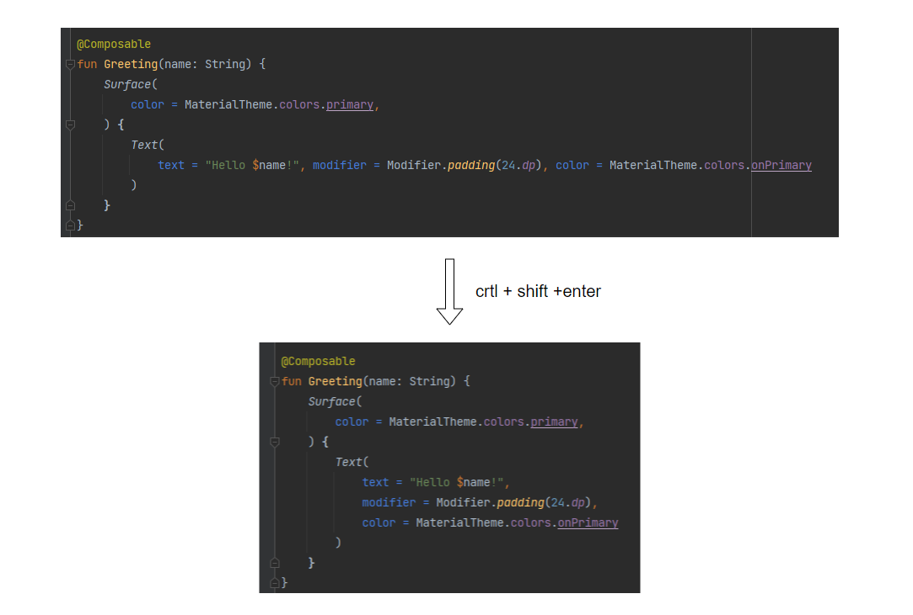

# 快捷键

### 快速选中多个相同代码段

全选中代码段之后狂按<kbd>Alt</kbd>+<kbd>J</kbd>

### surround with widget

选中一行之后按下<kbd>crtl</kbd>+<kbd>alt</kbd>+<kbd>J</kbd>就可以弹出右边窗口，选中之后即可实现包裹功能；

### 将一行代码展开成多行代码

> 好像默认是只有超过三个元素才能使用，在modifier这种的级联调用同样能这样运行。