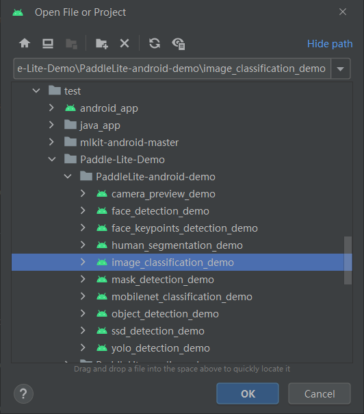
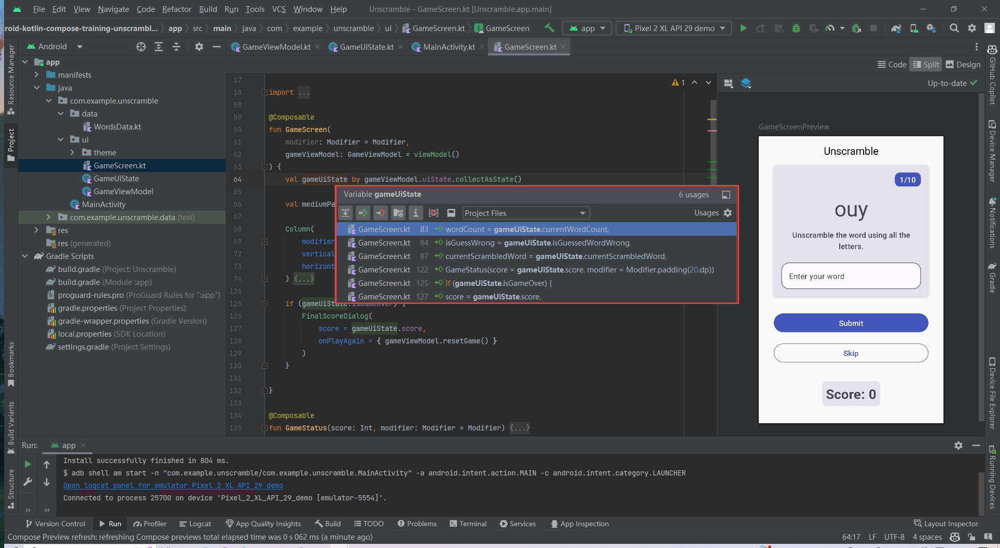
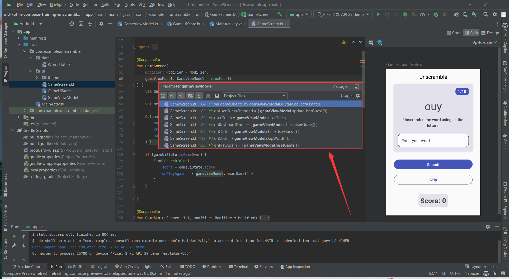
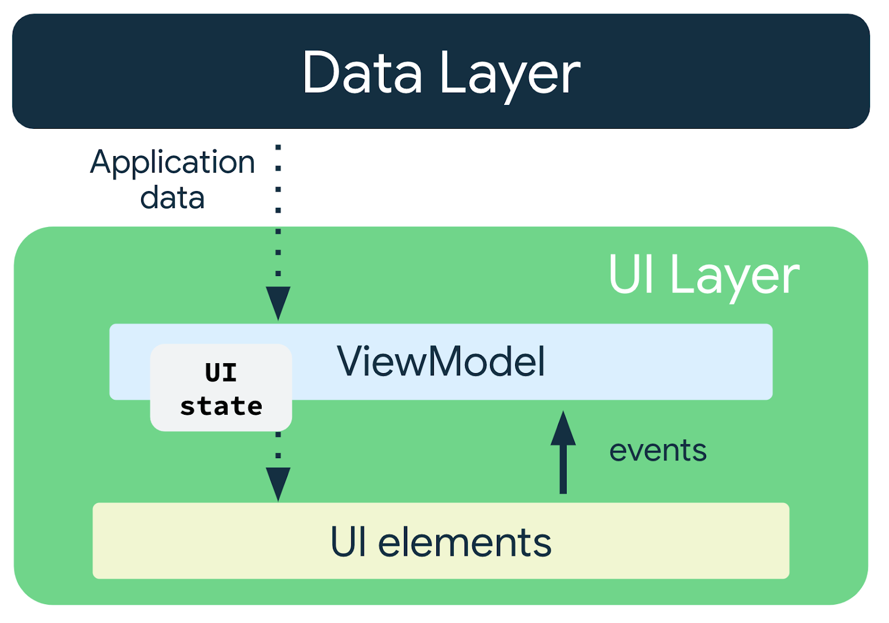
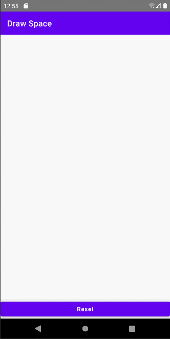
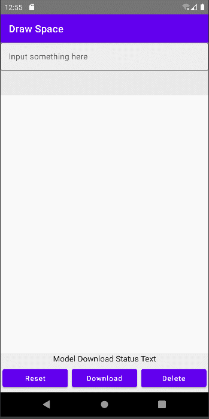
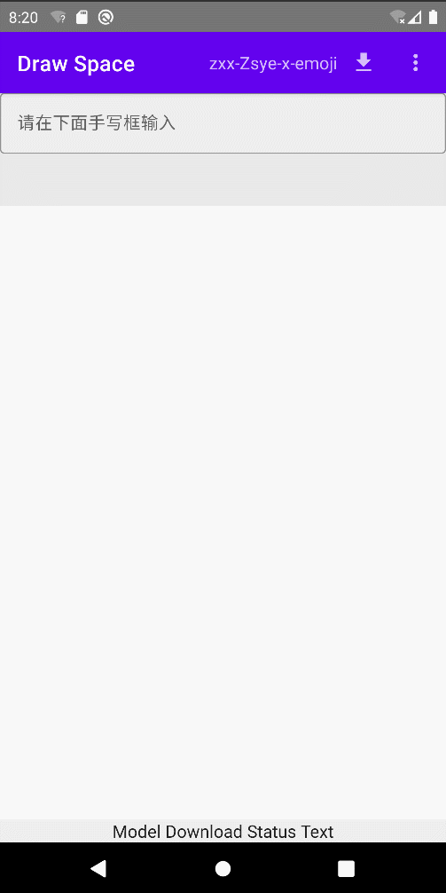

## 2.23

解决连接手机开发问题

[(203条消息) 记录Android Studio连接华为(nova)手机鸿蒙系统踩过的坑_android studio 鸿蒙_沉迷单车的追风少年的博客-CSDN博客](https://blog.csdn.net/qq_41895747/article/details/127779815)

[(203条消息) Android Studio连接手机教程_这也太南了趴的博客-CSDN博客_android studio怎么连接手机](https://blog.csdn.net/qq_46941656/article/details/119935227?spm=1001.2101.3001.6650.6&utm_medium=distribute.pc_relevant.none-task-blog-2~default~BlogCommendFromBaidu~Rate-6-119935227-blog-127365384.pc_relevant_3mothn_strategy_recovery&depth_1-utm_source=distribute.pc_relevant.none-task-blog-2~default~BlogCommendFromBaidu~Rate-6-119935227-blog-127365384.pc_relevant_3mothn_strategy_recovery&utm_relevant_index=13)

## 2.24

一定要在虚拟的avd机关闭之后再关闭笔记本，否则会虚拟机会保持原来的状态、而且再次打开android studio会发现打不开虚拟机（一直黑屏）

## 3.8

### TextView.textSize的设置问题

网上没有搜索到正确答案，自己看文档边猜边弄出来的，需求为：希望通过按钮加或减调节字体的大小，

- 想法：定义一个`var textSize = textView.textSize`通过`textSize+=1`或者`textSize-=1`的方式操作，最后赋值`textView.textSize = textSize`，但现实是不可行；

#### 解决：

原因就是在`TextView`自己的`setTextSize`方法中就已经自带了放缩`scale`的功能，而且仅限于第一次传值的时候（即第一次执行`textView.textSize = textSize`）会这样，所以如果要把`.xml`的文件信息正确加载出来且可以使得我们传值不受影响，我们就直接先放缩一遍就好了：

```kotlin
val textView = findViewById<TextView>(R.id.textView)
var textSize = textView.textSize / resources.displayMetrics.scaledDensity
textView.textSize = textSize

// button控制代码
val button2 = findViewById<Button>(R.id.button2)
button2.setOnClickListener {
    textSize -= 1
    textView.textSize = textSize
}
```

## 3.9

### 加载了21M大小的三体小说txt文本后出现的问题

```
I/stmultiactivit: Background young concurrent copying GC freed 22638(576KB) AllocSpace objects, 0(0B) LOS objects, 0% free, 21MB/21MB, paused 328us total 112.763ms
I/Choreographer: Skipped 93 frames!  The application may be doing too much work on its main thread.
D/EGL_emulation: eglMakeCurrent: 0xecc7f940: ver 2 0 (tinfo 0xecc89f00)
I/Choreographer: Skipped 34 frames!  The application may be doing too much work on its main thread.
```

提示我们说在主线程干太多事情了，而且这样导致的问题是加载后页面会很慢，转动屏幕时的重新加载可能也是这样；

### 如何分页

[Android Paging 基础知识  | Android Developers](https://developer.android.com/codelabs/android-paging-basics?hl=zh-cn#0)

这个教程是讲如何下拉时加载文件资源刷新显示的，并不是我们理解上的分页知识内容；还是得等学习了够多再回来看一下；

在compose中可以很简单实现，用lazyRow或者lazyColumn即可，而不需要那种recycleView之类的东西

## 4.13

发现一个问题就是在开发的过程中，如果想去修改底层的一个ui控件（比如进行一个状态提升），由于在整个项目中都会很多地方用到这个控件，所以我们得把用到它的所有地方一一修改，不然单独测试的时候（比如希望单独运行这个小控件的preview是执行不了的，要是运行的话甚至会出现报错`Caused by: org.gradle.api.GradleException: Compilation error. See log for more details`完全摸不着头脑）:cry:

> PS：今天android结课了，要开始认真的开发了

另外一个小tips发现，用android studio的split那个preview的功能可能会很方便地提示你哪里报错了；而直接点击绿色三角形那个东西运行之后debug的报错会让你摸不着头脑；

目前问题：

- 没有理解ViewModel和LiveData的知识，对数据存储方面有困难 -->看完老师视频

## 5.7

更新之后的android studio无法运行旧的项目

- 更新了kotlin等等一系列的版本问题
- 可能是AVD的问题，新建了一个项目显示不支持老的版本了
- 记得把项目中gradle jdk版本改成11以下
- 初步学了huggingface的一系列操作，但拿到api部署到android上还暂时不知道怎么做；
  - 如果像里面文档说的那样可以有多个模型的api都可以使用那就是太好了


- 目前调研结果就是如果使用huggingface上的接口需要0.06$每个小时，也就是0.36￥每个小时，论开发的话得很快做完，而且用户可能得翻墙才能使用模型，不划算也不方便调试；

## 5.8

- 决定尝试一下paddlelite是否可行

正确的clone方法，之前一直在错误的develop分支上克隆，导致错误

```bash
git clone -b master https://github.com/PaddlePaddle/Paddle-Lite-Demo.git
```



- `couldn't find "libpaddle_lite_jni.so"`一直没办法解决，看了很多github上的issue，最终也没有办法解决
- 不可行，已有项目文件太大，自己部署起来过于麻烦；

- 不知道怎么办才好，如果现在更换方向就太晚了可能，之前好的想法全都做不出来
- 先给自己定硬性指标，17号之前完成app的所有开发，在这之前先部署好每个小功能的应用，如果来不及就算了，18号完成报告并录制视频提交就好了

想做一些功能小的，好用的app，不连接网络，17-8=9，也就一共九天的时间，自己很难开发出更好的app，不如从现在开始做一下小而精的app就好，做一个人工智能交互模型之前讨论过了，一是要api要花钱，在原有基础上做感觉又很难改进别人的demo，现在唯一能做的 事情感觉还是专：

## 5.9

- 再学习一遍ViewModelhttps://developer.android.com/codelabs/basic-android-kotlin-compose-viewmodel-and-state?hl=zh-cn#2
- 明天规划一下就可以专门做那个app的分析了

## 5.10

完成对ViewModel的详细学习，学到了对很多状态的管理方式，然后现在的规划是做一个MVVM架构，在`Unscramble`的app中自己对ViewModel又有了新的体会，总而言之就是要理清关于ViewModel、Activity、State三个东西的关联，每个activity一定程度上都相当于一个观察者，去观察或者更改ViewModel中的数据，而State则是一个状态流，但它返回的应该是当前状态的信息，我们通过ViewModel将数据处理（或者说ViewModel中存储一部风界面UI层的数据）,然后ViewModel去更改State的值，总结如下：

在Composable函数（UI层）中

- 我们只能去读State的值，而不直接改，下图中我们可以看到定义的gameUiState的值都是被读入



- 我们通过调用ViewModel中的函数去改变State中的数据、或者界面层从数据：





> ViewModel和UI state都还是属于UI层的

---

分割线更新一下当前思路：

当你有一个想法的时候，不要急于想着基于所学知识马上就开始做，先去网上找类似想法的模型代码，当你找到第一个最符合你想法的模型后，赶紧clone下来跑一遍，读代码知道大概思路和所用技术之后也不要急着马上就开始做，去以这些技术的关键词继续查找有没有更加符合你想法的模型，很幸运，这样就会出现第二个第三个甚至最符合你想法的模型都有，好，事实可能证明，你的想到的大部分可能别人都想到了，只不过别人想的和自己只有一点点出入而已。总而言之，言而总之，殊途同归。站在巨人肩膀上创新必然不是蠢事。

目前android希望用的技术确定下来了，mlkit jetpack compos digitalink；

自己目前参考觉得最有用的github仓库：

- [在 Android 上使用机器学习套件识别数字墨水  | ML Kit  | Google Developers](https://developers.google.com/ml-kit/vision/digital-ink-recognition/android?hl=zh-cn) android自带开发文档
- https://github.com/mohamedtamer0/TextRecognition-MLKit-jetPackCompose 文本识别
- https://github.com/surajsau/ML-Android.git 输入日语

### 选题过程

#### Pytorch

- [(241条消息) 在Android设备部署PyTorch模型_android pytorch_紫芝的博客-CSDN博客](https://blog.csdn.net/qq_40507857/article/details/118755061)
- https://github.com/pytorch/android-demo-app

在android上装一个pytorch，无论也说服不了自己（觉得在移动端训练又或者推理都觉得过于耗费移动端有限的资源、无论从续航性能速度等等角度而言都不行），第一时间否掉了这个方案；

#### huggingface

由于自己想着不能在手机上训练，自己短时间也训练不了很大的模型，决定采用调用api的方法：即推理过程全部跑在服务器上，而不需要耗费本地移动端的资源，这样相对好接受一点，于是就采用了huggingface

> huggingface介绍。。。

最后没有决定使用huggingface的api，原因如下：

- huggingface的api太贵；
- 自己上传模型之后发现推理速度也比较一般，只是CPU的API就需要使用0.06$每小时，上面一些有意思的模型，文生图，图生图，图生文，hugging自己家的chat(gpt)，又或者更惊艳一点的文字生成视频全部需要超级强的显卡算力支持，而这部分的api贵到自己一个做结课设计的大学生无法接受的程度了（觉得可能商业级的app用一下还差不多）
- 第三，做好的app用户需要翻墙才能使用。。。（这一点不好给同学测试也不好传播）

下面是自己调研huggingface模型部署在android端的所有教程、记录：

- [huggingface/pytorch-image-models: PyTorch image models, scripts, pretrained weights -- ResNet, ResNeXT, EfficientNet, EfficientNetV2, NFNet, Vision Transformer, MixNet, MobileNet-V3/V2, RegNet, DPN, CSPNet, and more (github.com)](https://github.com/huggingface/pytorch-image-models)
  - 下面都是使用huggingface API接口开发的博客
  - [Training a Deep Learning Model for Cell Counting in 17 Lines of Code with 17 Images (dicksonneoh.com)](https://dicksonneoh.com/portfolio/training_dl_model_for_cell_counting/)
  - [Bringing High-Quality Image Models to Mobile: Hugging Face TIMM Meets Android & iOS (dicksonneoh.com)](https://dicksonneoh.com/portfolio/bringing_high_quality_image_models_to_mobile/)
  - [Deploying Object Detection Models on Hugging Face Spaces (dicksonneoh.com)](https://dicksonneoh.com/portfolio/deploy_icevision_models_on_huggingface_spaces/)
  - [How to Deploy Object Detection Models on Android with Flutter (dicksonneoh.com)](https://dicksonneoh.com/portfolio/how_to_deploy_od_models_on_android_with_flutter/)
- huggingface app部署教程
  - [Build and Deploy a Machine Learning App in 2 Minutes - YouTube](https://www.youtube.com/watch?v=3bSVKNKb_PY&ab_channel=HuggingFace)

#### PaddleLite

既然国外的太贵，不符合自己需求那就采用国内的产品PaddleLite

> PaddleLite是百度家的人工智能部署在android上的库

- [Paddle-Lite-Demo/PaddleLite-android-demo at master · PaddlePaddle/Paddle-Lite-Demo · GitHub](https://github.com/PaddlePaddle/Paddle-Lite-Demo/tree/master/PaddleLite-android-demo)
- [PaddlePaddle/Paddle-Lite-Demo at master (github.com)](https://github.com/PaddlePaddle/Paddle-Lite-Demo/tree/master)
  - 上面的中文博客也是最多的（csdn上）：
  - [(241条消息) 超最简单的安卓端深度学习模型部署教程——pytorch2onnx2pdinfer2android_不变强不改名的博客-CSDN博客](https://blog.csdn.net/m0_58772523/article/details/121890631)

最后没有采用。

> 在paddleLite介绍最详细的一个示例image_classification的demo中，自己按照官方的教程去一步一步配置了，最后卡死在一个bug上，去查github上别人的issue，发现一样的问题在2020就被提出了，2021有人问了一遍，2022又有人问了一遍，没人解决，自己有点绝望，不采用他们的架构，感觉社区没人维护，案例不及时更新；

#### ML Kit

ML Kit是android开发官方指定的机器学习套件，上面的案例每个都是可以直接运行，没有报错（主要是社区很完善） ，最后决定做一个小的输入法的app

## 5.11

实现简单画图功能：



> 我们可以看到上面会从左上角直接画到董字的开头，在真机上测试过之后发现这个问题其实是由于AVD虚拟机响应太慢了才会出现的，在真机上只有一直不间断点reset刷新、一边画画才会出现上面的状况，这其实我们下面代码中的作用：

```kotlin
prevX = when (drawPath) {  // 获取上一个点的横坐标
    is DrawPath.MoveTo -> (drawPath as DrawPath.MoveTo).x
    is DrawPath.CurveTo -> (drawPath as DrawPath.CurveTo).x
    else -> 0f
}

prevY = when (drawPath) {  // 获取上一个点的纵坐标
    is DrawPath.MoveTo -> (drawPath as DrawPath.MoveTo).y
    is DrawPath.CurveTo -> (drawPath as DrawPath.CurveTo).y
    else -> 0f
}
```

在实现drawPath什么都没有或者由于程序运行反应不过来的时候会出现`else`中的情况，就会导致两个都设为preX和preY均设置为0f，这样就会出现上面问题，再一般情况下的手写输入不会出现上面问题；

## 5.12~5.13

试了很多错，现在问题是下载模型的时候报错了，再仔细看看是什么地方出错；

```
Error while downloading the model: java.lang.Exception: java.util.concurrent.ExecutionException: com.google.android.gms.internal.mlkit_vision_digital_ink.zzv: Failed to download file group zxx-Zsye-x-emoji
                                                                                                    2 failure(s) in total:
                                                                                                    
                                                                                                    --- Failure 1 ----------------------------
                                                                                                    com.google.android.gms.internal.mlkit_vision_digital_ink.zzbj: REQUEST_ERROR Message: java.net.SocketException: socket failed: EPERM (Operation not permitted);
                                                                                                    Caused by: com.google.android.gms.internal.mlkit_vision_digital_ink.zzxr: java.net.SocketException: socket failed: EPERM (Operation not permitted)
                                                                                                    Caused by: java.net.SocketException: socket failed: EPERM (Operation not permitted)
                                                                                                    --- Failure 2 ----------------------------
                                                                                                    com.google.android.gms.internal.mlkit_vision_digital_ink.zzbj: REQUEST_ERROR Message: java.net.SocketException: socket failed: EPERM (Operation not permitted);
                                                                                                    Caused by: com.google.android.gms.internal.mlkit_vision_digital_ink.zzxr: java.net.SocketException: socket failed: EPERM (Operation not permitted)
                                                                                                    Caused by: java.net.SocketException: socket failed: EPERM (Operation not permitted)
                                                                                                    -------------------------------------------
```

从网络下载模型记得添加：

```
<!-- For downloading -->
<uses-permission android:name="android.permission.INTERNET" />
<uses-permission android:name="android.permission.ACCESS_NETWORK_STATE" />
```

加完之后记得删除原来在AVD上app再重新安装过

## 5.14

早上九点前开发进度



基本开发功能已经实现

- 在屏幕上画画
- 实时获得笔画信息
- 成功下载预测模型
- 预测识别字体并返回

但其中出现的bug也不少：

- 每次写完之后不会自动清除
- 每写完一个字之后才显示上一个字的识别情况，这不符合用户习惯

> 上面两点很有可能是viewModel的状态没有及时更新的状况才会出现的

- 选择一个输入之后到上面文本框之后再手写输入就会全部清空

> 这个得回去看逻辑

- 改掉一输入完毕就清空的bug
- 还有对于emoji来说结果不好
  - 应该是没有及时清空ink.builder

> 上面问题解决了，问题是因为对状态_uiState的管理不对，中途更新了状态

- 现在还是有一个问题，输出的识别预测列表和手写输入会差一个延迟（写入下一个字才显示上一个字的预测结果）
  - 应该是触发更新的问题，自己目前是当手指离开页面并过1s后开始预测列表 
  - 但有可能更改完毕后没有刷新页面，等到手指再次离开才刷新，状态才得以返回

> 解决这一问题了，原理就是在加载预测列表的时候要异步执行，而且得等待预测执行完之后再返回状态

- 可以考虑作成输入法app，支持悬浮控件一起？
  - 和其它app在一起结合使用

> 这个问题目前还不能解决，需要获得系统的权限，而且目前手机都是自带的输入法app，要获得更高的权限可能得涉及到不同手机的操作权限问题，有点难做，先做其它的；

## 5.15

- 将底层栏全部去除，添加一些关于模型下载的状态处理，目前app的开发效果展示如下：



查了一下能否做成插件的情况，微信的有自己的接口和开发文档，在官方文档看到这句话：

> 请到 开发者应用登记页面 进行登记，登记并选择移动应用进行设置后，将该应用提交审核，只有审核通过的应用才能进行开发。

只有后面才考虑能不能做了，结课设计这周就必须提交了，做成微信插件等之后有时间再做吧~🔗如下。

[Android接入指南 | 微信开放文档 (qq.com)](https://developers.weixin.qq.com/doc/oplatform/Mobile_App/Access_Guide/Android.html)

在这里感觉也可以集成到华为手机输入法中的插件中去，更方便查找表情包；

## 5.16


- 完善模型选择功能
  - 先考虑一下能不能做成数据库的形式（使用ROOM等形式）
  - 如果不能，那么应该如何实现搜索模型的功能（字段匹配没有试过）
- 设置一个用户偏好界面
  - 里面出现可以勾选的一些text
  - 来让用户自动调整是否显示底边栏

> 上面的也完成了，剩下要做的事情就是如何改掉最后一个bug

- 正确的清理方法可能还是和那个页面刷新的机制有关
  - 准备删掉之后又马上被设置了回来所以导致报错可能
  - 删的时候不能一直刷新页面

> 上面问题解决，我们应该将请求发到remoteManager添加到一个TASK队列里面去，处理完一个删除的任务再处理另一个，如果采用for循环的形式由viewModel直接调用的话则会删除失败，或者只删除一个模型

- 添加保存数据的代码，记录用户的preference

> 上面问题完成

## 5.17

- 为app添加图标

> 记住一定要在AVD上跑一遍更换图标后的应用之后再build APKs，不然图标得不到更新
>
> 另外有一个bug就是当利用电脑端QQ发送安装包给手机端下载的时候，QQ会自动索引到该文件夹，再关闭QQ之前无法在android studio运行项目，提示无法删除apk，事实就是QQ上传文件的时候获得文件的管理权限，android studio运行项目每次跑一次都会清除旧的apk，如果无法删除则报错，此时就关闭QQ即可。

## 接下来要做的事情

- 完成app设计，提交报告，录制一个简单的介绍视频
